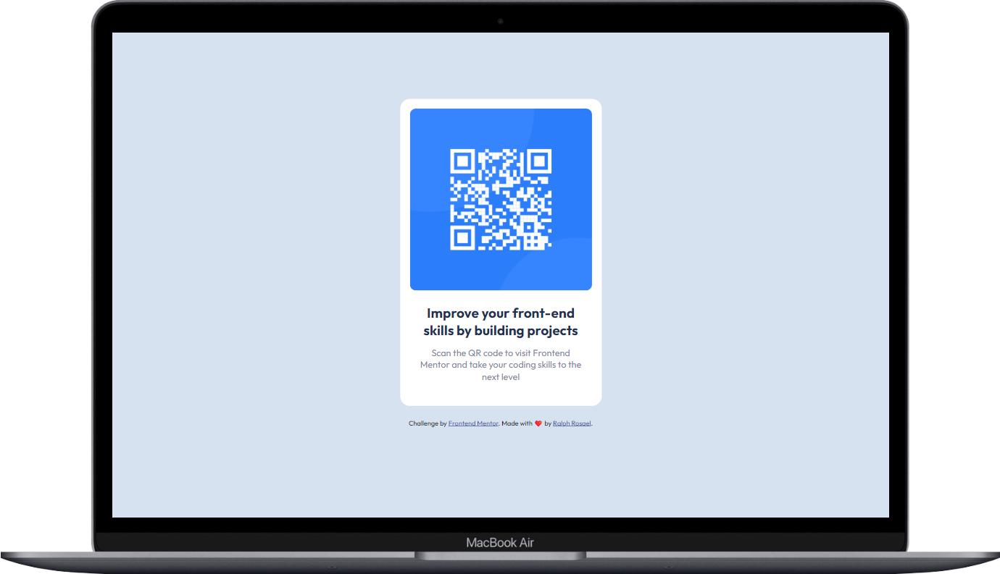
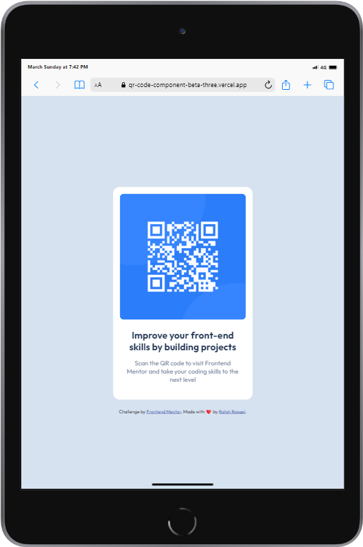
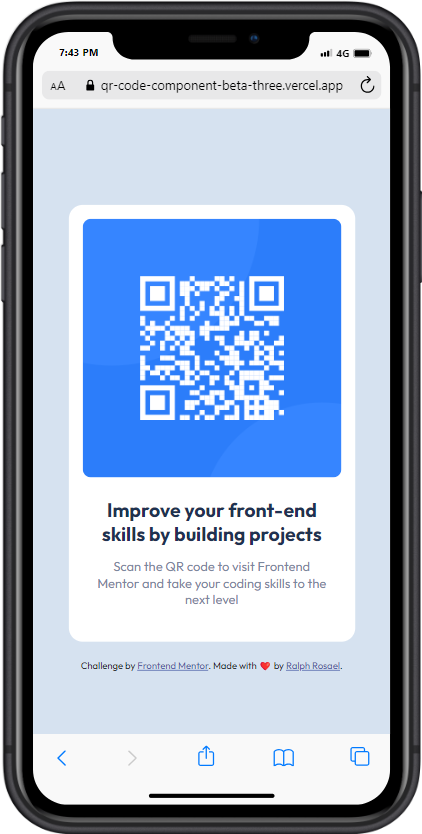

# Frontend Mentor - QR code component

This is a solution to the [QR code component challenge on Frontend Mentor](https://www.frontendmentor.io/challenges/qr-code-component-iux_sIO_H). [Frontend Mentor](https://www.frontendmentor.io) challenges help you improve your coding skills by building realistic projects.

## Table of contents

- [Overview](#overview)
  - [Screenshot](#screenshot)
- [Deployment](#deployment)
  - [Links](#links)
- [My process](#my-process)
  - [Built with](#built-with)
  - [Host used](#host-used)
- [Author](#author)

## Overview

### Screenshot

#### Dekstop View

#### Tablet View

#### Mobile View

## Deployment

### Links

- Solution URL: [GitHub Repository](https://github.com/coder-ralph/QR-code-component)
- Live Site URL: [Deployed Site](https://qr-code-component-beta-three.vercel.app/)

## My process

### Built with

- Semantic HTML5 markup
- CSS custom properties
- CSS Grid
- Mobile-first workflow

### Host used

This project is hosted on [Vercel](https://vercel.com/). I chose Vercel for its seamless deployment and hosting capabilities.

## Author

- Frontend Mentor - [@Ralph Rosael](https://www.frontendmentor.io/profile/coder-ralph)
- GitHub - [@Ralph Rosael](https://github.com/coder-ralph)